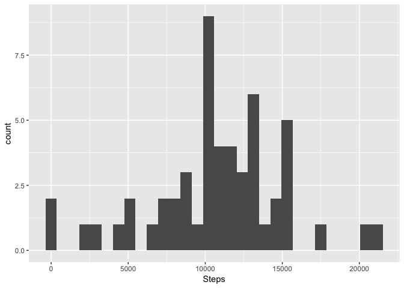
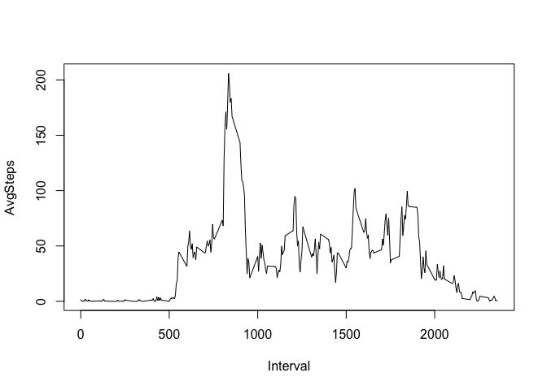
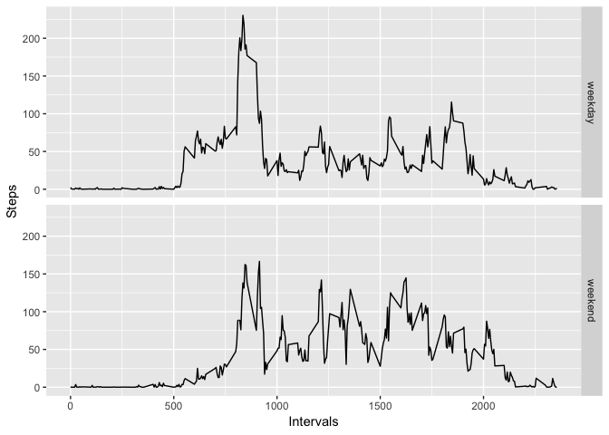

## Course Project 1

### What is mean total number of steps taken per day?

Load the data


```r
df <- read.csv("activity.csv")
```

Calculate the total number of steps taken per day. If you do not understand the difference between a histogram and a barplot, research the difference between them. Make a histogram of the total number of steps taken each day.


```r
library(ggplot2)
sd <- data.frame(Day = unique(df$date),
                 Steps = tapply(df$steps, df$date, sum))
g <- ggplot(sd, aes(Steps))
g + geom_histogram(na.rm=T)
```

```
## `stat_bin()` using `bins = 30`. Pick better value with `binwidth`.
```

<!-- -->

Calculate and report the mean and median of the total number of steps taken per day.


```r
summary(df$steps)
```

```
##    Min. 1st Qu.  Median    Mean 3rd Qu.    Max.    NA's 
##    0.00    0.00    0.00   37.38   12.00  806.00    2304
```

### What is the average daily activity pattern?

Make a time series plot of the 5-minute interval (x-axis) and the average number of steps taken, averaged across all days (y-axis).


```r
Interval <- subset(df, date == df$date[1])$interval
AvgSteps <- tapply(df$steps, df$interval, mean, na.rm = T)
plot(Interval, AvgSteps, type = "l")
```

<!-- -->

Which 5-minute interval, on average across all the days in the dataset, contains the maximum number of steps?


```r
Interval[which.max(AvgSteps)]
```

```
## [1] 835
```

### Imputing missing values

Calculate and report the total number of missing values in the dataset (i.e. the total number of rows with NAs).


```r
sum(is.na(df))
```

```
## [1] 2304
```

Devise a strategy for filling in all of the missing values in the dataset. The strategy does not need to be sophisticated. I chose here the average number of steps for each interval.  
Create a new dataset that is equal to the original dataset but with the missing data filled in.


```r
df$steps[which(is.na(df$steps))] <- tapply(df$steps, df$interval, mean, na.rm = T)[
  as.character(df$interval[which(is.na(df$steps))])
]
```

Make a histogram of the total number of steps taken each day and Calculate and report the mean and median total number of steps taken per day. Do these values differ from the estimates from the first part of the assignment? What is the impact of imputing missing data on the estimates of the total daily number of steps?


```r
sd2 <- data.frame(Day = unique(df$date),
                 Steps = tapply(df$steps, df$date, sum))
g2 <- ggplot(sd, aes(Steps))
g2 + geom_histogram(na.rm=T)
```

```
## `stat_bin()` using `bins = 30`. Pick better value with `binwidth`.
```

<!-- -->

```r
summary(df$steps)
```

```
##    Min. 1st Qu.  Median    Mean 3rd Qu.    Max. 
##    0.00    0.00    0.00   37.38   27.00  806.00
```

Imputing NAs does not change the mean or median. 

### Are there differences in activity patterns between weekdays and weekends?

Create a new factor variable in the dataset with two levels – “weekday” and “weekend” indicating whether a given date is a weekday or weekend day.


```r
df$date <- as.Date(df$date, "%Y-%m-%d")
df$weekday[grepl("Sun|Sat", weekdays(df$date, abbreviate = T))] <- "weekend"
df$weekday[grepl("Mon|Tue|Wed|Thu|Fri", weekdays(df$date, abbreviate = T))] <- "weekday"
df$weekday <- as.factor(df$weekday)
```

Make a panel plot containing a time series plot (i.e. type = "l"\color{red}{\verb|type = "l"|}type="l") of the 5-minute interval (x-axis) and the average number of steps taken, averaged across all weekday days or weekend days (y-axis). See the README file in the GitHub repository to see an example of what this plot should look like using simulated data.


```r
Interval <- subset(df, date == df$date[1])$interval

df2 <- split(df, df$weekday)
AvgStepsWD <- tapply(df2$weekday$steps, df2$weekday$interval, mean, na.rm = T)
AvgStepsWE <- tapply(df2$weekend$steps, df2$weekend$interval, mean, na.rm = T)
df3 <- data.frame(Intervals = rep(Interval, 2), Steps = c(AvgStepsWD, AvgStepsWE), Moment = as.factor(c(rep("weekday", length(AvgStepsWD)), rep("weekend", length(AvgStepsWE)))))
g <- ggplot(df3, aes(Intervals, Steps)) + geom_line()
g  + facet_grid(rows=vars(df3$Moment))
```

<!-- -->
